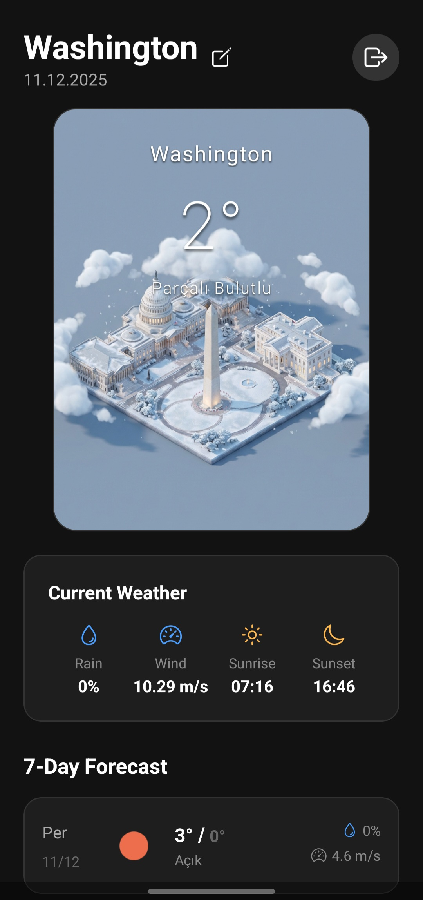

# Cubic Weather Project 🌤️

Welcome to the **Cubic Weather** ecosystem. This project represents a seamless fusion of precise meteorological data and generative artificial intelligence, delivering a weather experience that is not only informative but visually immersive. It consists of a high-performance **Backend API** and a polished **Mobile Application**.

---

## 📱 Mobile App

The mobile application is designed with a focus on user experience and visual elegance, customized to provide immediate value to the user.

### Key Features

- **⚡ Real-Time Weather Accuracy**:
  The app pulls the latest data including temperature, wind speed, humidity, and forecast predictions, ensuring you never leave the house unprepared.
- **🖼️ Dynamic AI Backgrounds**:
  Gone are the days of static wallpapers. The app displays unique, AI-generated cityscapes that reflect the _current_ weather conditions of your selected city—visualizing rain, snow, or clear skies in real-time.

- **🧩 Interactive Home Screen Widget**:
  Keep track of the weather without even opening the app. The fully integrated Android widget sits on your home screen, offering a quick snapshot of the weather along with the latest generated atmospheric visual.

---

## ⚙️ Backend API

The backend serves as the intelligent core of the ecosystem, managing data orchestration, image generation, and security.

### Architecture & Capabilities

- **🧠 AI Image Generation Pipeline**:
  Leveraging **Google GenAI (Nano Banana)**, the system constructs detailed prompts based on live weather parameters to generate high-quality, atmospheric city illustrations.

- **🕒 Automated Scheduling**:
  Using `node-cron`, the system intelligently schedules image updates, ensuring fresh visuals are available throughout the day without overloading the AI provider.

- **💾 Optimized Storage & Caching**:
  Generated images are efficiently stored and served statically, reducing latency for end-users and minimizing redundant API calls.

- **🔒 Robust Security**:
  All protected endpoints are secured using **JWT (JSON Web Tokens)**, ensuring that only authenticated applications and users can interact with sensitive features.

---

## 📸 Screenshots

  <h3>📱 Application Interface</h3>
  
<i>A clean, modern interface displaying detailed weather metrics.</i>

  
  
    

  <h3>🏙️ AI City Visualization</h3>
  
<i>An example of a dynamically generated cityscape reflecting local weather.</i>

  

---

